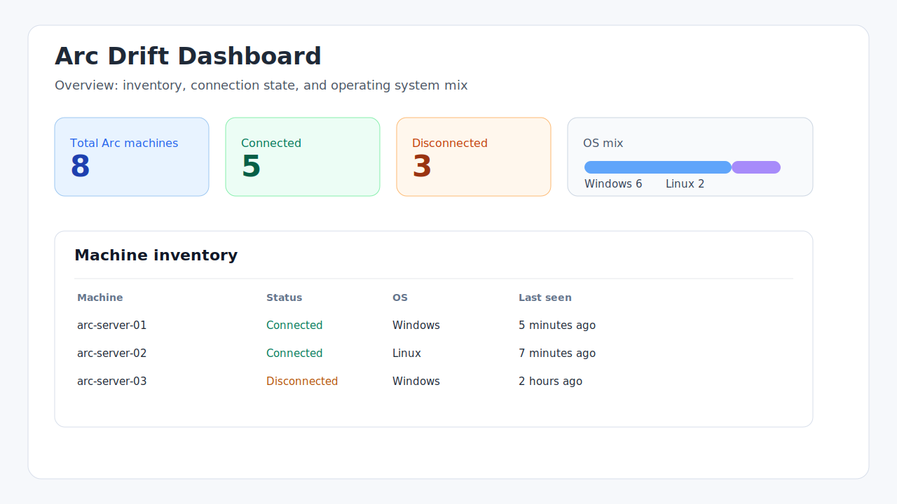
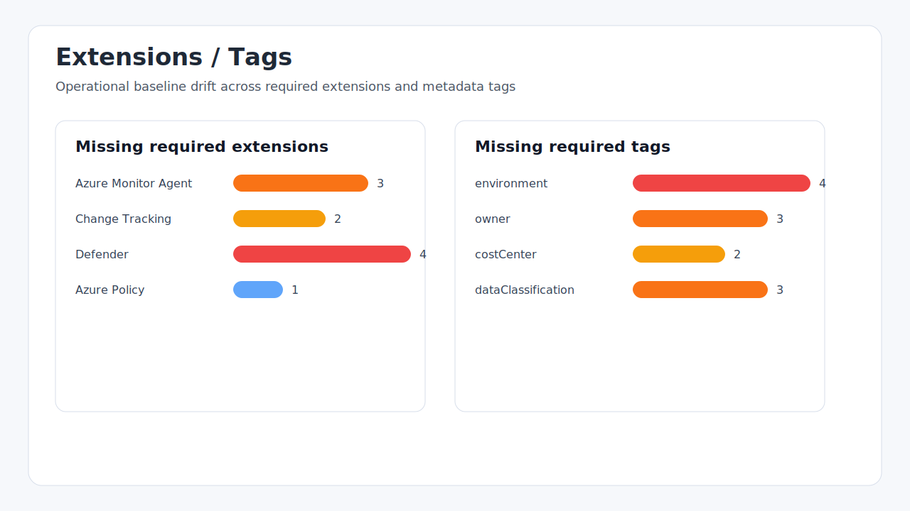
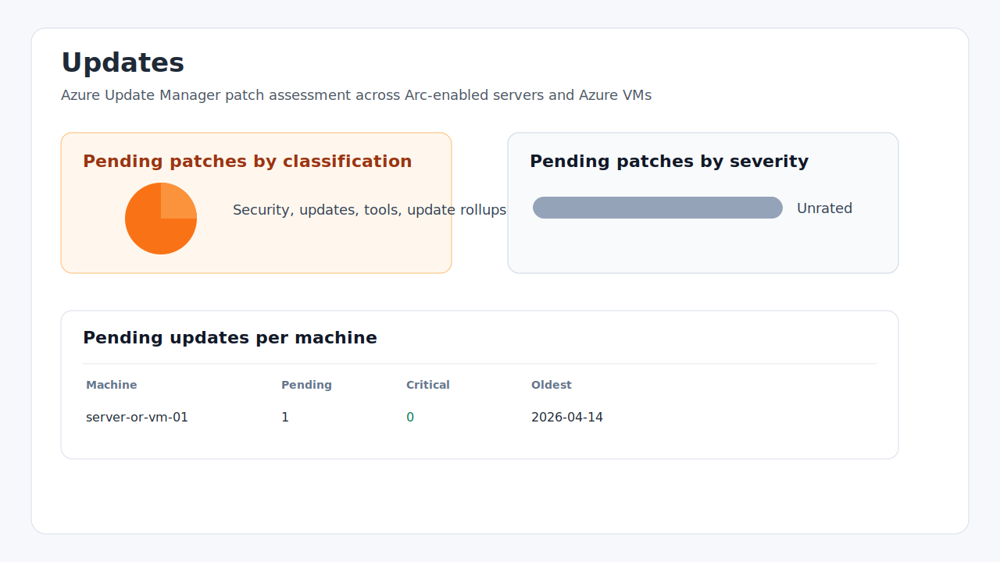
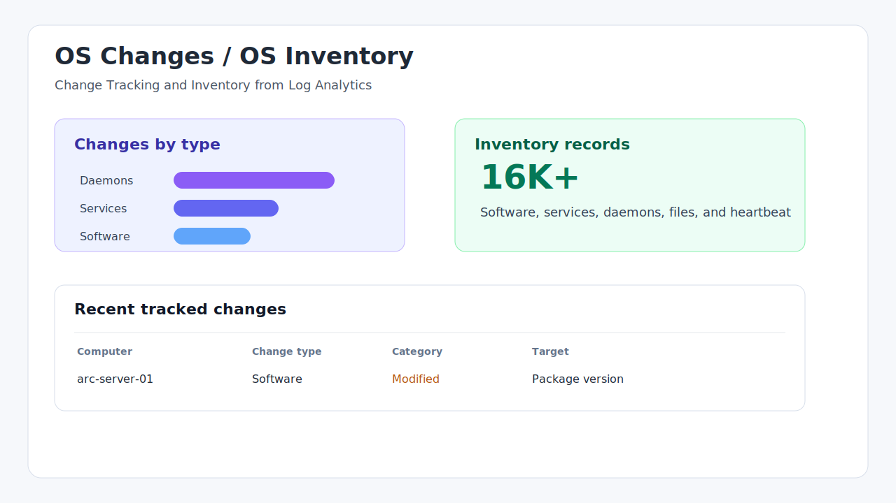

# Arc Drift Dashboard

An Azure-native drift detection dashboard for Azure Arc-enabled servers, delivered as an Azure Monitor Workbook plus supporting Azure Resource Graph (ARG), Log Analytics KQL, Bicep deployment, and a reference Azure Policy initiative.

The workbook is intentionally lightweight: no app hosting, no database, no custom identity, and no external service. Viewers use their own Entra identity and see only what Azure RBAC allows them to see.

## Screenshots

These representative screenshots show the dashboard flow and the type of data surfaced after deployment.

| Overview | Extensions and tags |
| --- | --- |
|  |  |

| Updates | OS changes and inventory |
| --- | --- |
|  |  |

## What it detects

### Azure control-plane drift

| Source | What it surfaces |
| --- | --- |
| Azure Resource Graph inventory | Arc machine connection state, OS mix, agent versions, locations, and extensions |
| Azure Policy | Non-compliant Arc machines vs. assigned policies and initiatives |
| Machine Configuration | Guest configuration assignment status and last reported compliance |
| Tags and extensions | Missing required tags and missing required operational extensions |
| Update Manager | Pending patches by classification, severity, and machine |
| Defender for Cloud | Open recommendations scoped to hybrid machines |

### In-OS drift

| Source | What it surfaces |
| --- | --- |
| Change Tracking and Inventory | File, registry, service, software, and daemon changes from `ConfigurationChange` |
| Inventory collection | Software, services, daemons, files, and heartbeat freshness from `ConfigurationData` and `Heartbeat` |
| App Config tab | Incident-window filtering, sensitive configuration changes, and fleet-level file hash drift |

## Repository layout

```text
workbooks/      Azure Monitor Workbook JSON template
queries/arg/    Standalone Azure Resource Graph queries
queries/kql/    Standalone Log Analytics KQL queries
infra/          Bicep deployment files
policies/       Reference Azure Policy initiative for an Arc baseline
docs/           Architecture, deployment, customization, troubleshooting, and screenshots
```

## Quick deploy

Prerequisites:

- Azure CLI signed into the target tenant
- A resource group to host the workbook
- A Log Analytics workspace receiving Arc / AMA / Change Tracking data
- Reader access to the subscriptions that contain Arc-enabled servers

```powershell
az deployment group create `
  --resource-group <resource-group> `
  --template-file infra/main.bicep `
  --parameters workbookDisplayName='Arc Drift Dashboard' `
               logAnalyticsWorkspaceId='/subscriptions/<sub>/resourceGroups/<rg>/providers/Microsoft.OperationalInsights/workspaces/<workspace>'
```

After deployment, open **Azure Portal > Monitor > Workbooks > Arc Drift Dashboard**.

See [Deployment guide](docs/deployment.md) for detailed setup, RBAC, validation, and troubleshooting steps.

## Customization

The default baseline is intentionally simple and easy to modify:

- Required tags: `environment`, `owner`, `costCenter`, `dataClassification`
- Required extensions: Azure Monitor Agent, Change Tracking, Defender, and Azure Policy
- Update posture: Update Manager patch assessment data from Arc machines or Azure VMs
- OS drift: Change Tracking and Inventory tables in Log Analytics

See [Customization guide](docs/customization.md) for where to adjust baselines, labels, tabs, and KQL.

## Required RBAC

| Scope | Role | Why |
| --- | --- | --- |
| Subscription(s) with Arc machines | Reader | ARG inventory, policy state, guest config, update assessment |
| Log Analytics workspace | Log Analytics Reader | Change Tracking, inventory, heartbeat, and OS drift views |
| Defender for Cloud subscription scope | Security Reader | Defender recommendations |
| Workbook resource group | Workbook Reader or Reader | Open the workbook |

## Validation

```powershell
az bicep build --file infra/main.bicep --outfile $env:TEMP\arc-drift-main.json
node -e "JSON.parse(require('fs').readFileSync('workbooks/arc-drift-dashboard.workbook.json','utf8')); console.log('workbook json ok')"
```

## License

MIT - see [LICENSE](LICENSE).
